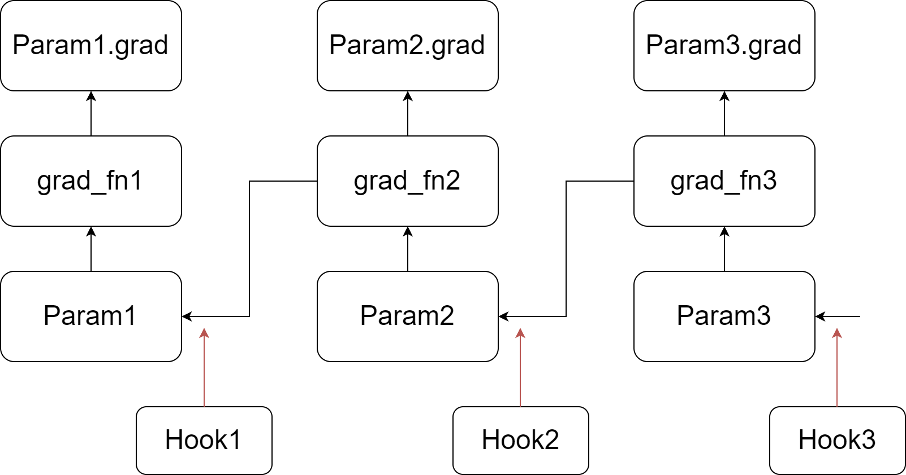

[**English**](./README.md) | [**中文**](./README_ZH.md)

# LOMO: LOw-Memory Optimization

This is the implementation for [Full Parameter Fine-Tuning for Large Language Models with Limited Resources](https://arxiv.org/pdf/2306.09782.pdf).

In this work, we propose a new optimizer, **LO**w-Memory **O**ptimization (**LOMO**), which fuses the gradient computation and the parameter update in one step to reduce memory usage.
Our approach enables the full parameter fine-tuning of a 7B model on a single RTX 3090, or 
a 65B model on a single machine with 8×RTX 3090, each with 24GB memory.

LOMO is integrated with [CoLLiE](https://github.com/OpenLMLab/collie) library, which supports Collaborative Tuning of Large Language Models in an Efficient Way.


---
## Dependencies
```shell
torch
deepspeed
transformers
peft
wandb
```
The minimum dependency is PyTorch, and others are used to reproduce our paper results. 
## Run the code
```shell
bash run.sh
```
To change the model size, dataset or hyperparameters, please modify the files under `config`.

## Reproduce our results
We provide the sampled datasets used in our experiments [here](https://drive.google.com/drive/folders/1zV7sXvU7YHKWyS3fYV0yyi7FyTjIpEuO?usp=sharing).
Due to the limited computational resources, we reported the highest results obtained from experiments conducted with the same random seed (`42`).
We acknolwedge this limitation in our work and plan to conduct repeated experiments in the next version to address it.
Feel free to raise an issue if you have any questions.

## Implementation

Our implementation relies on injecting hook functions into PyTorch's backward pass. As depicted in the figure, we register a customized hook function for each parameter. When the gradient of a parameter is computed (prior to writing it to the .grad attribute), its corresponding hook function is invoked. For more information about hook functions and the backward pass of the autograd graph, please refer to [PyTorch's documentation](https://pytorch.org/docs/stable/notes/autograd.html#backward-hooks-execution). In summary, during the backward pass, we go through a tensor and its grad_fn, write the gradient into the .grad attribute, and then pass to the next tensor.

Our customized hook function scans all the parameters, updating a parameter if its .grad attribute is not empty, and then clears and frees the .grad attribute. Since the hook function for a parameter is called before its .grad attribute is set, the .grad attribute of the last parameter in the autograd graph is not ready when the last hook function is invoked. Therefore, we perform an additional scan to update the last parameter.