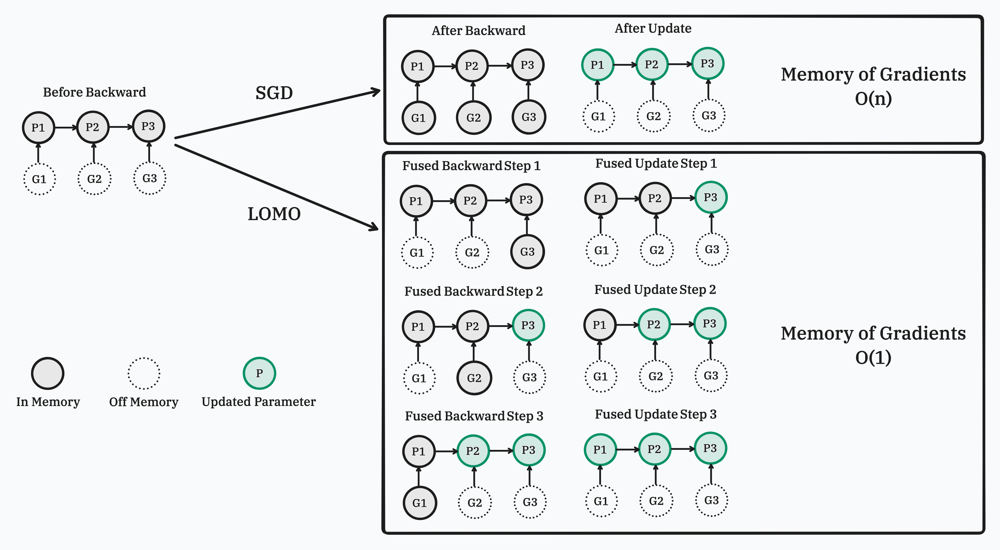

[**English**](./README.md) | [**中文**](./README_ZH.md)

# LOMO: LOw-Memory Optimization

论文 [Full Parameter Fine-Tuning for Large Language Models with Limited Resources](https://arxiv.org/pdf/2306.09782.pdf) 的实现.

在这个工作中，我们提出了一个新的优化器，**LO**w-Memory **O**ptimization (**LOMO**)，它将梯度计算和参数更新融合在一步中，以减少内存使用。
我们的方法使得在单张 RTX 3090 上可以进行 7B 模型的全参数微调，或者在单个 8×RTX 3090 的机器上可以进行 65B 模型的全参数微调（RTX 3090 的内存为 24GB）。

LOMO已经集成到了 [CoLLiE](https://github.com/OpenLMLab/collie) (Collaborative Tuning of Large Language Models in an Efficient Way) 中。



## 依赖
```shell
torch
deepspeed
transformers
peft
wandb
```
LOMO本身只依赖 PyTorch，其他依赖用于复现我们的论文结果。

## 执行代码

我们提供了三种不同方法来微调大型语言模型（LLM）的代码：**LOMO**，**LoRA**和**LoRA + LOMO**。

1. 对于使用LOMO进行完全参数微调的实现位于`src/lomo_trainer.py`，您可以运行以下命令：
```shell
deepspeed --master_port "$port" --include localhost:"$CUDA_VISIBLE_DEVICES" src/train_lomo.py config/args_lomo.yaml
```

2. 对于LoRA和LoRA + LOMO的实现位于`src/lomo_lora_trainer.py`，您可以运行以下命令：
```shell
deepspeed --master_port "$port" --include localhost:"$CUDA_VISIBLE_DEVICES" src/train_lomo_lora.py config/args_lomo_lora.yaml
```
在代码中，我们在`src/arguments.py`中包含了`lora_only`参数，用于控制是否仅使用LoRA或LoRA + LOMO。请注意，当将`lora_only`设置为`True`时，与LOMO相关的参数将不起作用。

此外，我们还提供了一个简单的`run.sh`脚本以方便使用。您可以使用以下命令执行代码：
```shell
bash run.sh
```

对于数据处理，我们目前只提供了论文中提到的SuperGLUE的六个数据集。如果您希望使用新的数据集，请相应地修改`Dataset`和`DataCollator`。

对于评估，我们目前仅为[多项选择问答（multiple-choice QA）](https://github.com/OpenLMLab/LOMO/blob/91cc71387d0a576c000a7dc568543c4ef22401db/src/lomo_trainer.py#L259-L276)和[生成（generation）](https://github.com/OpenLMLab/LOMO/blob/91cc71387d0a576c000a7dc568543c4ef22401db/src/lomo_trainer.py#L278-L297)任务提供了`eval_step`代码。如果您有其他需求，请相应地修改`LOMOTrainer`或`LOMOLoRATrainer`中的`eval_step`代码，并为训练器提供必要的`compute_metrics`函数。

## 复现我们的结果
我们在[这里](https://drive.google.com/drive/folders/1zV7sXvU7YHKWyS3fYV0yyi7FyTjIpEuO?usp=sharing)提供了我们实验中使用的采样数据集。
由于计算资源有限，我们报告了使用相同随机种子（`42`）进行的实验中获得的最高结果。
我们在我们的工作中承认了这个限制，并计划在下一个版本中进行重复实验来解决这个问题。

> 如果您有任何问题，请随时提出问题。

## 实现

我们通过在PyTorch的反向传播过程中注入钩子函数实现我们的方法。如图中所示，我们为模型的每一个参数都注册了自定义的钩子函数。当一个参数的梯度计算完毕之后(但还没有写入到.grad)，它对应的钩子函数就被调用了。更多关于钩子函数和反向传播的介绍可以参考[PyTorch的官方文档](https://pytorch.org/docs/stable/notes/autograd.html#backward-hooks-execution)。简而言之，反向过程会从一个张量到它的梯度函数，然后把梯度写入.grad，再传递到下一个张量。

我们的自定义钩子函数会扫描所有的参数，如果发现有.grad不为空的参数就进行更新，然后清空并释放相应的.grad。因为一个参数的钩子函数会在它的.grad还未被赋值时调用，整个求导图的最后一个参数的钩子函数调用时，它的.grad还不可用。因此，我们额外进行一次扫描来更新最后一个参数。

## 引用
```text
@inproceedings{Lv2023FullPF,
  title={Full Parameter Fine-tuning for Large Language Models with Limited Resources},
  author={Kai Lv and Yuqing Yang and Tengxiao Liu and Qi-jie Gao and Qipeng Guo and Xipeng Qiu},
  year={2023}
}
```